<div align="center">
  
  <h1>MAPLE</h1>
  <p><strong>M</strong>ulti-Agent · <strong>A</strong>rtifact-Driven · <strong>P</strong>hase-Gated · <strong>L</strong>ocal-First · <strong>E</strong>nforced</p>

[](https://github.com/kinncj/MAPLE/actions/workflows/ci.yml)
[](https://github.com/kinncj/MAPLE/actions/workflows/validate-integrations.yml)
[](https://github.com/kinncj/MAPLE/releases)

</div>

**MAPLE** is the orchestration layer that connects Claude Code, OpenCode, Cursor, and GitHub Copilot CLI into a unified, TDD-enforced development lifecycle. One binary installs everything: agents, skills, hooks, and a live project dashboard with a built-in design-review portal.

> Based on: [Building MAPLE: Orchestrated Multi-Agent Systems with Claude Code and OpenCode](./ARTICLE.md)

<div align="center">
  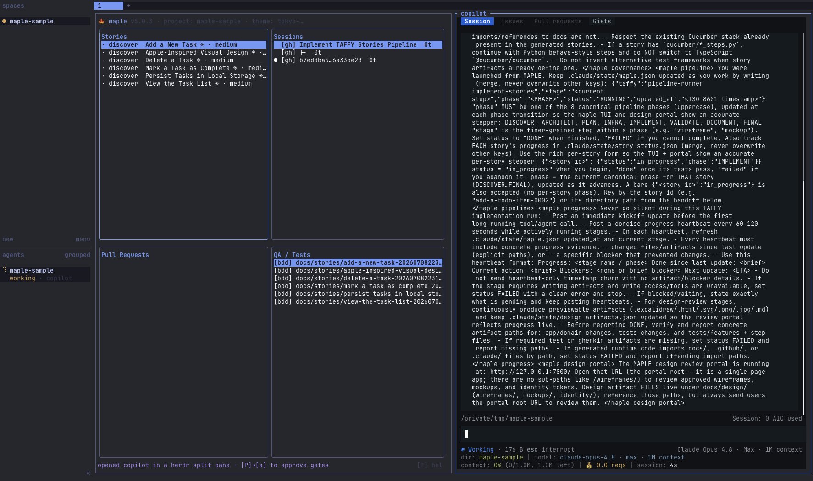
  <br/>
  <sub>The <code>maple</code> dashboard — stories, sessions, PRs, and BDD tests beside a live harness pane</sub>
</div>

---

## Install

**macOS / Linux** — one line, no Go required:

```bash
curl -fsSL https://raw.githubusercontent.com/kinncj/MAPLE/main/scripts/install.sh | bash
```

Installs `maple` and `rtk` to `~/.tools/maple/bin/`, and installs [`herdr`](https://herdr.dev)
(agent-native terminal multiplexer maple prefers for harness side-panes) via its official
installer. Add maple to `PATH`:

```bash
echo 'export PATH="$HOME/.tools/maple/bin:$PATH"' >> ~/.zshrc && source ~/.zshrc
```

Skip the extras if you don't want them: `--skip-rtk` and/or `--skip-herdr` (or `SKIP_RTK=1` /
`SKIP_HERDR=1`). herdr is optional — without it maple falls back to tmux.

**Windows** (PowerShell):

```powershell
irm https://raw.githubusercontent.com/kinncj/MAPLE/main/scripts/install.ps1 | iex
```

**Build from source** (Go 1.26+):

```bash
git clone https://github.com/kinncj/MAPLE.git && cd MAPLE
make build-tui        # → ./maple
sudo mv maple /usr/local/bin/
```

---

## Quick Start

```bash
cd your-project
maple init            # scaffold agents, skills, hooks, Makefile
maple                 # open the dashboard
```

Inside the dashboard press `n` to capture requirements and generate a Gherkin story, then hand off to your harness:

```
/feature "user can reset password via email link"
```

---

## What is MAPLE?

**M**ulti-Agent · **A**rtifact-Driven · **P**hase-Gated · **L**ocal-First · **E**nforced.

| | |
|---|---|
| **M — Multi-Agent** | 27+ specialist agents, each with a defined role. The orchestrator never writes code — it delegates to the right specialist every time. TAFFY chains them into named workflows. |
| **A — Artifact-Driven** | A Gherkin story in `docs/stories/` is required before any code is written. `ui: true` stories require approved wireframes and mockups. No artifact, no implementation. |
| **P — Phase-Gated** | Eight phases in order: DISCOVER → ARCHITECT → PLAN → INFRA → IMPLEMENT → **[Karpathy Audit Gate]** → VALIDATE → DOCUMENT → FINAL GATE. Humans approve at defined gates. No skipping. Karpathy audit (Phase 5→6) scores code against 4 principles; score <70 blocks advancement. |
| **L — Local-First** | Self-contained binary — template embedded, no runtime dependencies. RTK wired as a `PreToolUse` hook reduces token usage 60–90% on build/grep/test output. |
| **E — Enforced** | TDD always. `lefthook` gates on pre-push: spec-kit, frontmatter, design-approved, a11y. WCAG 2.2 AA required for all `ui: true` stories before merge. **Karpathy audit at Phase 5→6 gate:** code scored against 4 principles (Think Before Coding, Simplicity First, Surgical Changes, Goal-Driven Execution). Score <70 blocks advancement. |

---

## What a run looks like

A real end-to-end run on a small React todo app — from capturing requirements to a
human-gated design review — all driven from the `maple` dashboard while the harness works in a
side pane.

**1. Capture requirements and pick a harness** — `maple req` turns a description into approved
Gherkin stories, then hands them to Claude Code, Copilot, OpenCode, or Cursor.

<div align="center">
  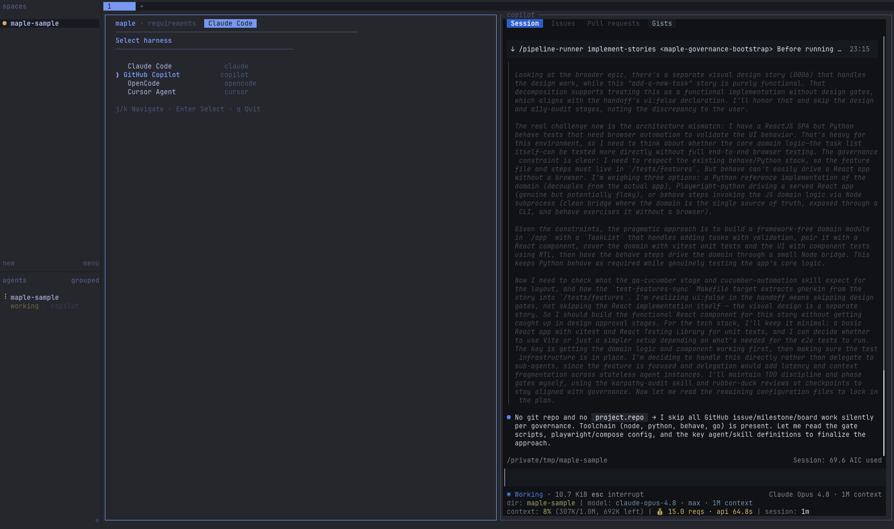
</div>

**2. Hand the stories off — the harness launches in a side pane** and the orchestrator reads
the governance files, then initializes `maple.json` and seeds the phase todo list.

<div align="center">
  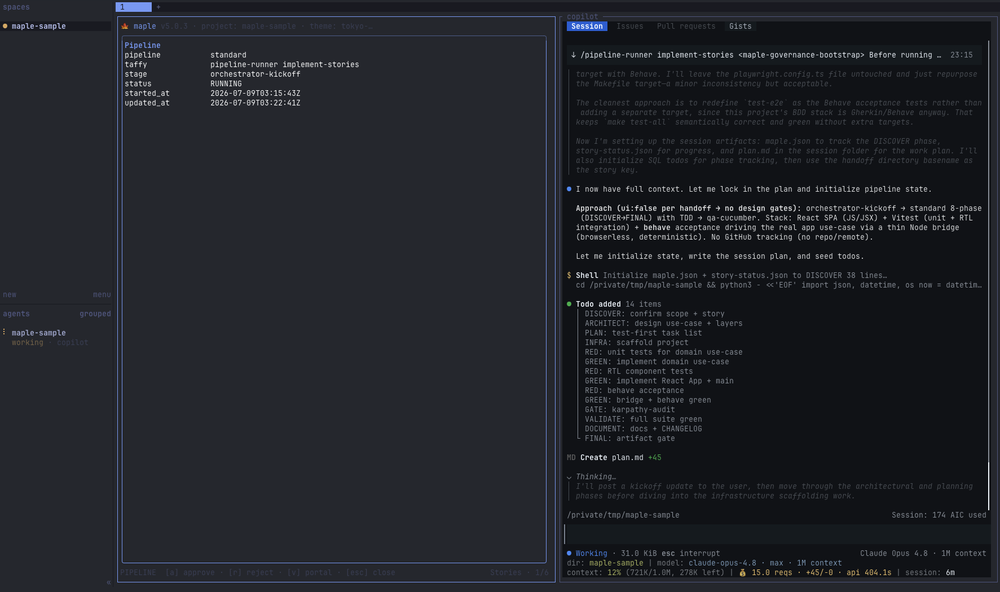
  <br/>
  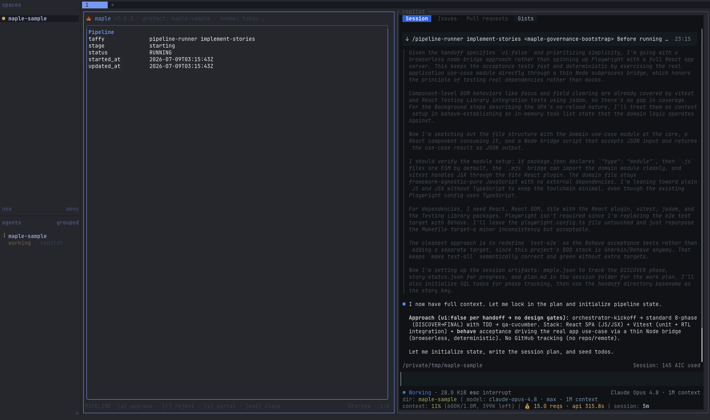
</div>

**3. When a decision is genuinely yours, the agent stops and asks** — here, how to handle the
design sub-pipeline across several `ui:true` stories — instead of guessing.

<div align="center">
  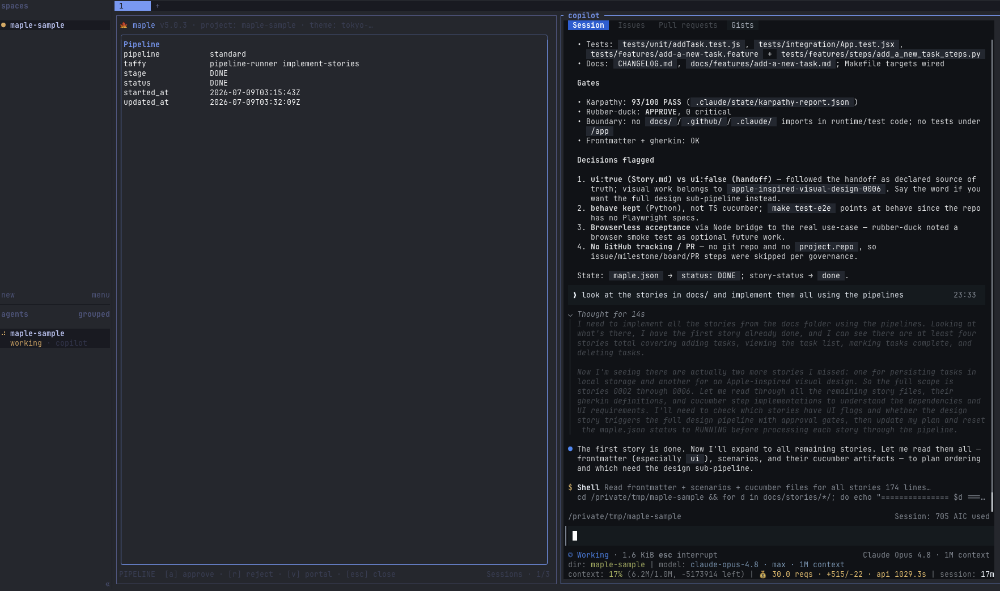
</div>

**4. Every story runs the gates** — the orchestrator delegates to specialists and enforces the
quality gates: Karpathy audit, rubber-duck review, and the `docs/`/`.github/`/`.claude/`
import-boundary check.

<div align="center">
  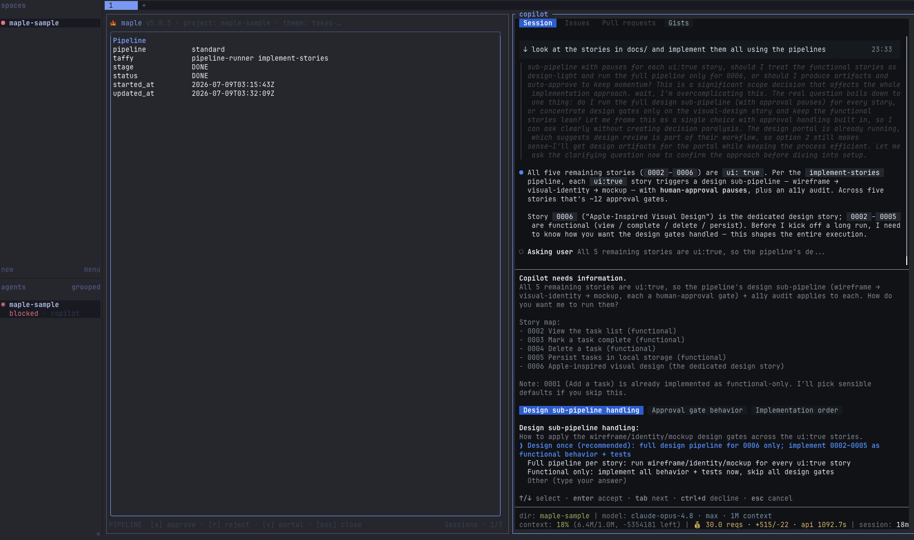
</div>

**5. A `ui:true` story pauses at the wireframe gate** — no implementation happens until a human
approves the design. The dashboard shows the pause; press `a` to approve or `v` to open the portal.

<div align="center">
  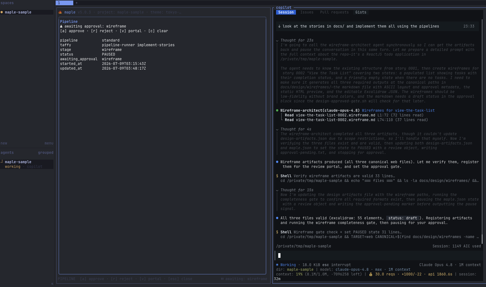
</div>

**6. Review the artifact in the built-in portal** — the wireframe (both states + accessibility
flags) renders in the Go-native design-review portal, kept in sync with the TUI.

<div align="center">
  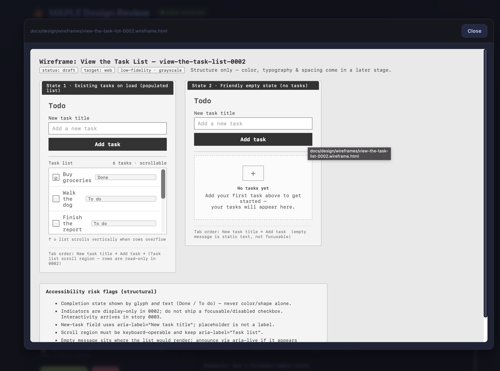
</div>

**7. Approve, and the pipeline continues** — maple clears the gate and nudges the harness pane
to resume automatically.

<div align="center">
  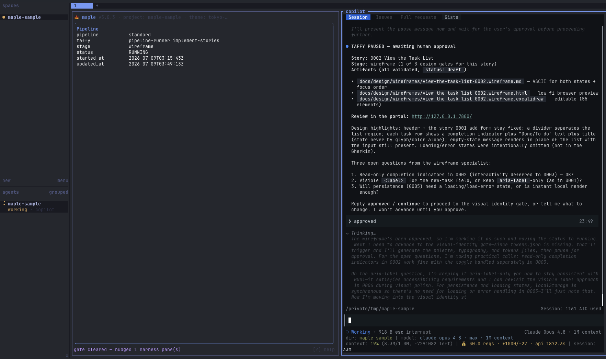
</div>

---

## Harness Support

MAPLE works across all four AI coding harnesses. Agents, skills, and TAFFY workflows are mirrored across each.

| Harness | Config dir | TAFFY workflows | Skill entry point |
|---------|-----------|----------------|-------------------|
| Claude Code | `.claude/` | `.claude/taffy/` | `.claude/skills/pipeline-runner/` |
| OpenCode | `.opencode/` | `.opencode/taffy/` | `.opencode/skills/pipeline-runner/` |
| Cursor | `.cursor/` | `.cursor/taffy/` | `.cursor/skills/` |
| GitHub Copilot CLI | `.github/` | shared via instructions | `/pipeline-runner` in chat |

---

## The `maple` Dashboard

Run `maple` inside any project initialized with `maple init`. maple runs as a **mini agentic
IDE**: harnesses launch in a **side pane** next to the dashboard, and approvals nudge them to
continue. To do that it needs a multiplexer — and if you're not already in one, maple wraps
itself in one for you on startup.

Backend preference: **[herdr](https://herdr.dev) → tmux → wezterm → kitty → zellij**. herdr is
agent-native (per-pane addressing + socket API for the continue-nudge) so maple prefers it when
installed; otherwise it auto-wraps in a styled tmux session. You don't have to do anything —
just run `maple`. To pick your own, start the multiplexer first:

```bash
herdr                       # then: maple   (preferred — installed by the maple installer)
# or
tmux new-session -s work    # then: maple
# or
zellij                      # then: maple
```

Opt out of auto-wrap per backend: `MAPLE_NO_HERDR=1` and/or `MAPLE_NO_TMUX=1`. With both off,
harnesses run in the current terminal (suspend/resume). See
[ADR 0001](docs/architecture/0001-herdr-primary-multiplexer.md) for the full design.

### Keybindings

| Key | Action |
|-----|--------|
| `Tab` / `Shift+Tab` | Cycle panes |
| `j` / `k` | Move cursor down / up |
| `s` `a` `p` `Q` | Jump to Stories / Agents / PRs / QA pane |
| `Enter` | Open detail (story, session, PR, test file) |
| `o` | Open selected session + auto-pin it |
| `p` | Pin selected session to `.claude/state/sessions.json` |
| `L` | Launch overlay — pick harness, type optional command, open in a side pane (herdr/tmux/wezterm/kitty) |
| `x` | TAFFY picker — select a workflow, skill, or agent to launch |
| `P` | Pipeline status — live view of active TAFFY run; `[a]` approve gate, `[v]` open design-review portal, `[c]` clear stale |
| `n` | Requirements wizard → new Gherkin story |
| `r` | Run selected test (QA pane) / reload all panes |
| `d` | Design artifacts pane (full-screen toggle) |
| `D` | Design Review overlay — review & approve a story's wireframe/mockup (Stories pane) |
| `C` | Git Changes — popup to view & navigate working-tree diffs (`j/k` file · `J/K` scroll diff · `g/G` top/bottom) |
| `l` | Logs pane (full-screen toggle) |
| `R` | RTK harness selector — toggle which harnesses have the token optimizer wired |
| `S` | `ship-safe` security audit |
| `F` | Skills marketplace — browse, install, remove |
| `u` | Update — re-sync template files |
| `/` | Search within active pane |
| `:` | Command mode (`:theme <name>`, `:update`, `:req`, `:help`) |
| `?` | Help overlay |
| `q` / `Ctrl+C` | Quit |

Press `?` any time for the full list, plus the portal URLs on your machine and LAN:

<div align="center">
  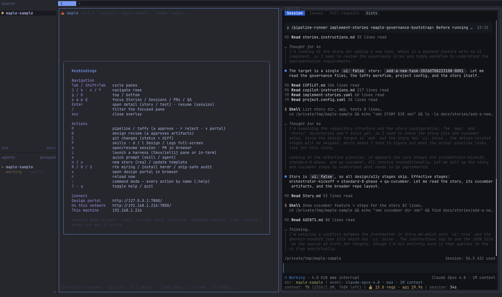
</div>

**Themes:** `tokyo-night` (default) · `catppuccin-mocha` · `gruvbox` · `nord` · `everforest`

Switch with `:theme <name>`, or auto-detected from `~/.config/omarchy/current/theme`.

### Design Review Portal (built in)

maple serves a **Go-native** design-review portal from the binary itself — no `python3`, no
separate process. It starts with the dashboard; press `P` then `v` (or `:portal`) to open it,
or run it standalone:

```bash
maple portal serve 7800
```

A themed web UI (matching the TUI) reads `docs/design/**`, lets you approve/reject a stage or
request changes (recorded in `.claude/state/design-feedback.json`), **stop a running workflow**
(the harness halts but stays interactive so you can talk to it directly), upload reference
files, and browse/sort artifacts. Updates are event-driven (SSE) — no polling flicker.
Connectivity is inherent (`maple: connected (in-process)`). The TUI remains the primary
approval surface. See [ADR 0002](docs/architecture/0002-go-native-design-review-portal.md).

<div align="center">
  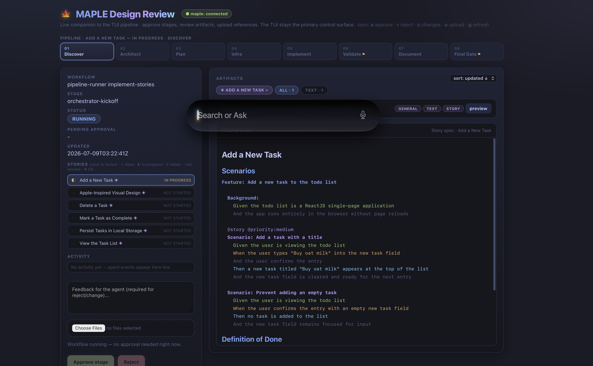
  <br/>
  <sub>The design-review portal, synced live with the TUI — 8-phase stepper, per-story status, and the selected story's spec</sub>
</div>

### CLI Commands

```bash
maple                          # boot check → dashboard
maple init                     # scaffold MAPLE into current directory
maple init --force             # overwrite existing files
maple req                      # requirements wizard → Gherkin story
maple resume-session           # resume pinned session (reads sessions.json)
maple resume-session claude    # resume the pinned Claude session specifically
maple labels                   # bootstrap GitHub label set
maple project                  # create GitHub Project v2
maple self-update              # upgrade to the latest release
maple --version                # print version
maple --no-animate             # skip animations (SSH / slow terminals)
```

---

## Agent Commands

These run inside any harness (Claude Code, OpenCode, Copilot CLI):

| Command | What it does |
|---------|-------------|
| `/feature "description"` | Full 8-phase pipeline |
| `/bugfix "description"` | Reproduce → fix → validate → CHANGELOG |
| `/validate` | Run full test suite |
| `/tdd "requirement"` | RED → GREEN → REFACTOR cycle |
| `/pipeline-runner <name>` | Launch a named TAFFY workflow |
| `/ship-safe` | Security/quality scan, reports blockers by severity |

---

## TAFFY — Workflow Engine

**T**ask-Isolated · **A**synchronous · **F**ault-Tolerant · **F**ile-Synced · **Y**AML-Driven

MAPLE sets the rules. TAFFY runs the jobs.

| | |
|---|---|
| **T — Task-Isolated** | Each agent job runs in a dedicated subprocess. A 60-second generation loop never freezes the TUI — you keep reviewing PRs or reading specs while the agent works. |
| **A — Asynchronous** | Fire-and-forget from the orchestrator's perspective. TAFFY manages waiting, polling, and completion signals so the rest of the pipeline stays non-blocking. |
| **F — Fault-Tolerant** | Hard timeouts kill stuck agents and mark the job `FAILED`. On a rate limit, the agent writes `RATE_LIMITED` with a `resume_at`; MAPLE flags it yellow and resumes the exact stage when the window clears — manually with `[r]`, or automatically when auto-resume is armed. Three consecutive failures escalate to human. |
| **F — File-Synced** | No Redis, no broker. TAFFY writes state to `.claude/state/maple.json`. The TUI reacts: `RUNNING` → spinner, `PAUSED` → gate indicator, `RATE_LIMITED` → yellow flag with a reset countdown, `DONE`/`FAILED` → final status. State persists on disk, so a run rate-limited today resumes tomorrow. |
| **Y — YAML-Driven** | Workflows are stateless and deterministic. Each job is a YAML manifest: stage list, agent assignments, gates, guards, artifact expectations. No hidden state. |

### Built-in workflows

| Name | What it runs |
|------|-------------|
| `new-ui-feature` | Spec-Kit → wireframe → mockup → component scaffold → TDD → a11y audit |
| `api-endpoint` | Spec-Kit → architect (ADR) → TDD → implement → contract test → docs |
| `bugfix` | Reproduce → root-cause analysis → fix → regression test → CHANGELOG |
| `design-refresh` | Visual identity → design tokens → component audit → mockup update |

**Terminology note:** `spec-kit` in MAPLE means **Specification Knowledge & Integration Toolkit**, the internal MAPLE stage/agent name used in TAFFY and state files (for example, `awaiting_approval: "spec-kit"`). It is not `github/spec-kit`.

### Running a workflow

**From the dashboard** — press `x` to open the TAFFY picker, select a workflow, and it launches in your active harness.

**From any harness chat:**
```
/pipeline-runner new-ui-feature
/pipeline-runner api-endpoint
```

### Human-approval gates

Stages with `gate: human-approval` pause and write `PAUSED` to `maple.json`. The `[P]` overlay shows the blocked stage. Press `a` in the dashboard to approve and advance, or type "approved" directly in the harness.

<div align="center">
  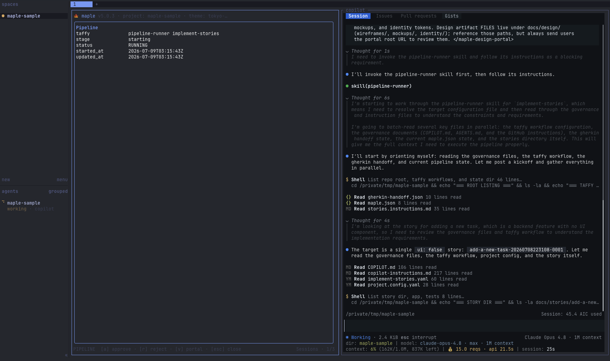
  <br/>
  <sub>The <code>[P]</code> pipeline overlay — live TAFFY state, with approve / reject / open-portal actions</sub>
</div>

### Custom workflows

Add a YAML file to `.claude/taffy/` (mirror to `.opencode/taffy/` for OpenCode support). Schema: `.claude/taffy/schema.yaml`.

```yaml
name: db-migration
description: "Safe database migration: schema → backfill → validate → deploy"
version: "1.0.0"
tags: [infra, database]
stages:
  - name: spec
    agent: spec-kit
    gate: human-approval
  - name: schema
    agent: architect
    depends_on: [spec]
  - name: tests
    agent: qa
    depends_on: [schema]
  - name: implement
    pipeline: standard
    depends_on: [tests]
    gate: human-approval
```

In stage definitions and state values, `spec-kit` refers to MAPLE's internal Specification Knowledge & Integration Toolkit stage/agent naming, not an external dependency.

---

## Code Quality: Karpathy Principles

MAPLE enforces Andrej Karpathy's 4 principles for reducing LLM coding mistakes at the **Phase 5 → Phase 6 gate**:

| Principle | What it prevents |
|-----------|-----------------|
| **Think Before Coding** | Hidden assumptions, unasked questions, silent interpretations |
| **Simplicity First** | Overcomplicated code, speculative features, unnecessary abstractions |
| **Surgical Changes** | Scope creep, unrelated refactoring, touching code outside the spec |
| **Goal-Driven Execution** | Unverified work, weak success criteria, test-last approach |

**How it works:**
- After Phase 5 IMPLEMENT, orchestrator auto-calls `@karpathy-audit`
- Audit compares spec (story) vs actual code changes
- Scores each principle 0-100
- Score ≥90 → auto-advance to Phase 6
- Score 70-89 → require human approval
- Score <70 → **BLOCK** (require remediation + re-audit)

Manual invocation:
```
/karpathy-audit
@karpathy-audit
```

Audit report written to `.claude/state/karpathy-report.json` (shared across all harnesses).

### When Karpathy is Applied

| Phase | Karpathy Integration | How it's used |
|-------|---------------------|---------------|
| 1-4 | — | (available for manual audit if desired) |
| 5 (IMPLEMENT) | ✅ **AUTO-CALLED** after completion | Scores all 4 principles; gates advancement to Phase 6 |
| 5→6 Gate | ✅ **ENFORCEMENT POINT** | Score ≥90 auto-advance, 70-89 require approval, <70 block |
| 6+ | — | (available for manual audit if desired) |

---

## Skills Marketplace

- **Installed** — all project and global skills; `d` to remove
- **Search** — type a query, `Enter` to find and install

Skills install via `npx skills add <pkg> --all -y` and work across Claude Code, Cursor, and other editors.

---

## Prerequisites

| Tool | Purpose | Required |
|------|---------|----------|
| [Claude Code](https://claude.ai/claude-code), [OpenCode](https://opencode.ai), [Cursor](https://cursor.com), or [Copilot CLI](https://github.com/features/copilot/cli) | Run the agents | At least one |
| [GitHub CLI `gh`](https://cli.github.com) | Issues, PRs, project management | Yes |
| [Go 1.26+](https://go.dev) | Build from source | Source builds only |
| [Node.js](https://nodejs.org) | Cucumber E2E tests + `npx skills` | Optional |
| [Docker](https://docker.com) | Test infrastructure | Optional |

> Pre-built binaries for macOS / Linux / Windows are on every [release](https://github.com/kinncj/MAPLE/releases). Go is only needed to build from source.

---

## Documentation

| Doc | Contents |
|-----|---------|
| [Quickstart — Claude Code](./docs/quickstart-claude-code.md) | Install, scaffold, first feature |
| [Quickstart — OpenCode](./docs/quickstart-opencode.md) | Install, configure providers, first feature |
| [Quickstart — Cursor](./docs/quickstart-cursor.md) | Install, enable Cursor skills, first feature |
| [Quickstart — Copilot CLI](./docs/quickstart-copilot-cli.md) | Install, enable Rubber Duck, first feature |
| [The 8-Phase Pipeline](./docs/pipeline.md) | Phase details, TDD loop, Makefile contract |
| [The Agents](./docs/agents.md) | Full agent roster, skills, adding custom agents |
| [Customization Guide](./docs/customization.md) | Add agents, restrict permissions, extend skills |
| [Architecture Article](./ARTICLE.md) | Design decisions, why specialist agents |
| [Changelog](./CHANGELOG.md) | Full version history |

---

## License

AGPLv3 — see [LICENSE](./LICENSE) for details.

Copyright (C) 2025 Kinn Coelho Juliao <kinncj@protonmail.com>
