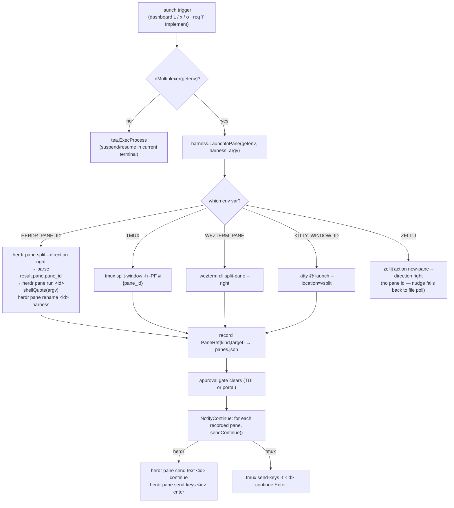

# 0001 — herdr as the primary split-pane backend

## 1. Context

maple runs harnesses (claude / copilot / opencode / cursor) beside the TUI so the
dashboard stays live while an agent works. That "beside" is a split pane in whatever
multiplexer maple is running inside. Today the backend detection is, in order: `tmux`,
`wezterm`, `kitty`, `zellij` — first matching env var wins. Everything the harness layer
needs from a backend is three operations:

1. **split** a pane to the right and run the harness command in it,
2. **address** that pane later (record a stable id), and
3. **nudge** it — type `continue` + Enter when a human approves a gate.

tmux/wezterm/kitty satisfy all three; zellij satisfies (1) only (no per-pane id), so its
harnesses fall back to the skill's file-poll for gate resumption.

[herdr](https://herdr.dev) (v0.7.2, Rust) is a terminal multiplexer purpose-built for AI
coding agents. Beyond splits + detach/reattach it exposes a **local socket API** with
first-class pane addressing (`w<ws>:p<n>`), `pane send-text` / `send-keys`, and — uniquely
— native **agent-state reporting** (`pane report-agent … --state idle|working|blocked`).
Its model is exactly what maple has been hand-rolling with `panes.json`, the portal control
socket, and the tmux sibling-broadcast nudge. The user runs herdr and asked for it to be the
primary backend when present.

## 2. Goals / Non-Goals

**Goals:**
- When maple runs inside a herdr session, use herdr for split + address + nudge, in
  preference to any other multiplexer.
- Keep tmux/wezterm/kitty/zellij as fallbacks unchanged — herdr is additive, never required.
- Route the `maple req` "Implement via TAFFY" launch through the same split-pane path as the
  dashboard `L` key, so it opens beside maple instead of taking over the terminal.
- No new compile-time dependency: shell out to the `herdr` binary, same as tmux.

**Non-Goals:**
- Auto-wrapping maple *into* a new herdr session on startup (the tmux `wrapInTmux` analog).
  herdr owns a persistent server/session lifecycle that is materially different from
  `tmux new-session`; wrapping into it is deferred to a later ADR.
- Feeding herdr's native agent-state UI (`pane report-agent`). Attractive follow-up, out of
  scope here.
- Bundling or installing herdr from maple's installer.

## 3. Proposal

Add a `herdr` case as the **first** branch of `harness.LaunchInPane`, gated on the
`HERDR_PANE_ID` env var that herdr injects into every managed pane. Detection precedence
becomes `herdr → tmux → wezterm → kitty → zellij`.

Backend operations map to the herdr CLI (all output is newline-delimited JSON):

| maple op | herdr command | Notes |
|---|---|---|
| split | `herdr pane split $HERDR_PANE_ID --direction right --ratio 0.5 --focus` | new id at `result.pane.pane_id` |
| run | `herdr pane run <id> "<shell-quoted argv>"` | `run` types one line into the pane's shell → argv is shell-quoted |
| title | `herdr pane rename <id> <harness>` | best-effort |
| nudge | `herdr pane send-text <id> continue` + `herdr pane send-keys <id> enter` | recorded in `panes.json` as `{kind:"herdr",target:"<id>"}` |

`InMultiplexer(getenv)` is centralised in the harness package (herdr-first env list) and
reused by `main.inMultiplexer()` (so startup auto-wrap skips when already in herdr) and by
`req.launchImplementation` (so TAFFY launches into a side pane when a multiplexer exists,
else falls back to the in-terminal `tea.ExecProcess`).

## 4. Alternatives Considered

| Option | Pros | Cons | Why Rejected |
|---|---|---|---|
| herdr as the *only* backend | Simplest code; agent-native features | Requires every user to install an AGPL/commercial, single-vendor tool; breaks the "you already have tmux" default | Rejected — raises adoption bar, single point of dependency |
| herdr as an *optional, lowest-priority* backend | Zero disruption | User explicitly wants it primary; buries its better nudge/addressing behind tmux | Rejected — contradicts the ask and wastes herdr's strengths |
| Adopt herdr's socket API to replace `portalsock` + `panes.json` wholesale | One orchestration surface | Couples maple's core to herdr API stability; large rewrite; only helps herdr users | Deferred — revisit once herdr is a proven dependency |
| **herdr primary when present, others as fallback (chosen)** | Uses herdr's strengths for herdr users; costs non-herdr users nothing | One more backend branch to maintain | Accepted |

## 5. Trade-offs and Risks

- **API drift.** herdr is young (0.7.x) and its CLI/JSON shape can change between releases.
  Mitigation: the integration is a thin shell-out isolated to `harness.go`, validated by
  unit tests (fake runner) plus a live round-trip proof against 0.7.2; a schema change
  surfaces as a launch error, not a crash, and non-herdr backends are unaffected.
- **`pane run` is shell-interpreted.** It types one line into the pane's shell rather than
  exec-ing argv, so maple must shell-quote (`shellQuote`). A quoting bug could mangle a
  prompt; covered by `TestShellQuote` and the `run … 'do it'` assertion.
- **Split output coupling.** We parse the new pane id from `result.pane.pane_id`. If herdr
  moves it, split "succeeds" with an empty id → we return an explicit error rather than
  address the wrong pane.
- **No herdr broadcast fallback yet.** The tmux path also nudges *sibling* harness panes
  maple didn't launch; herdr only nudges recorded panes. Acceptable — recorded panes cover
  the maple-launched flow (same guarantee as wezterm/kitty).

## 6. Impact

**FinOps:** None. No new service, no runtime cost; one extra `exec` per launch/nudge.

**SRE:** Failure is contained to a single harness launch — a herdr error returns
`(PaneRef{}, true, err)` and the caller surfaces it; maple keeps running. Blast radius is one
pane. Observability: launch errors reach the TUI error view; recorded refs live in
`panes.json`. Recovery: user relaunches, or falls back to another terminal.

**Security:** herdr's socket is a local Unix socket owned by the user (`~/.config/herdr/`).
maple only shells out to the `herdr` binary already on the user's PATH — no new network
surface, no credentials. herdr's license is **AGPL-3.0-or-later / commercial**; maple invokes
it across a process boundary (shell-out), so the AGPL copyleft does not reach maple's code.
maple neither bundles nor links herdr.

**Team:** One backend branch mirroring the existing tmux/wezterm/kitty pattern — no new
concepts for maintainers. herdr itself is optional; contributors without it rely on the fake-
runner unit tests.

## 7. Decision

Use herdr as the primary split-pane backend whenever maple detects it is running inside a
herdr session (`HERDR_PANE_ID`), keeping tmux/wezterm/kitty/zellij as unchanged fallbacks.
Integration is a thin, isolated shell-out in `app/internal/harness`, validated by unit tests
and a live round-trip against herdr 0.7.2. The `maple req` TAFFY launch now shares the
dashboard's side-pane path, so implementation opens beside maple instead of taking over the
terminal. herdr stays optional and un-bundled; auto-wrapping maple into a herdr session and
feeding herdr's native agent-state UI are deferred to future ADRs.

Status: **accepted**

## 8. Next Steps

- [x] herdr branch in `LaunchInPane` + nudge in `sendContinue` + `InMultiplexer` helper
- [x] TAFFY "Implement" launches into a side pane via `LaunchInPane`
- [x] Unit tests (fake runner) + live round-trip proof against herdr 0.7.2
- [ ] Follow-up ADR: auto-wrap maple into a herdr session on startup (herdr analog of `wrapInTmux`)
- [ ] Follow-up: report harness state to herdr via `pane report-agent` (native blocked/working/done UI)
- [ ] Follow-up: herdr sibling-pane broadcast for harnesses maple did not launch
