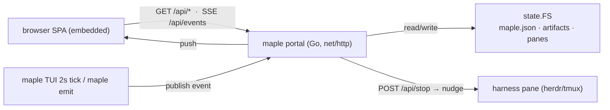

# 0002 — Go-native design review portal

## 1. Context

The design-review portal is `template/scripts/design-review-portal.{sh,py}` — a ~1700-line
Python `http.server` serving an embedded SPA, plus a Unix control socket the maple TUI holds
(`portalsock`) so the portal can show live connectivity and receive `maple emit` events.

It predates the `app/` rebuild (when maple was a bash CLI). Now maple is a single Go binary,
and the Python portal is the **only runtime dependency** left in a maple project — users
without `python3` cannot run it. It also **re-implements state** that `app/internal/state`
already owns: reading `maple.json` (pipeline/stage/status/approval), discovering design
artifacts, approving/rejecting gates, listing panes for the continue-nudge.

Recent portal work (thematic redesign, splash, filters, markdown/gherkin) improved the SPA,
and the user asked for more: contextual approval buttons (enabled only when a gate is
pending), a **Stop workflow** control, socket/event-driven updates (no 4s polling flicker),
and sortable/localStorage-persisted artifacts. Building those in Python means porting them
again later.

## 2. Goals / Non-Goals

**Goals:**
- Serve the portal from the maple Go binary — no `python3` dependency.
- Reuse `app/internal/state` for all reads/writes (single source of truth).
- Event-driven updates: maple already polls `maple.json` (2s tick); push SSE events on real
  change so the browser stops constant-refresh polling.
- Keep the SPA (HTML/CSS/JS) — embed it via `go:embed`; it is already good.
- In-process maple↔portal link (portal runs inside maple), so connectivity is inherent and
  the Unix-socket `portalsock` dance is no longer needed for the maple-alive signal.
- Add the requested controls in the Go version: contextual buttons, Stop workflow, sortable
  artifacts (name/created/updated, default updated, persisted to localStorage).

**Non-Goals:**
- Redesigning the SPA visuals (done in the prior pass).
- Changing the shared-state file protocol (`maple.json`, `approval-pending.txt`, panes.json).
- Removing `maple emit` — it stays as an agent → portal event channel.

## 3. Proposal

New package `app/internal/portal`: a `net/http` server that serves the embedded SPA and a
small JSON API, backed by `state.FS`.

Endpoints (parity with the Python server):
- `GET /` and `/index.html` → embedded SPA (token injected)
- `GET /health`
- `GET /api/state` → workflow/stage/status/approval/updated + maple connectivity
- `GET /api/artifacts` → design artifacts (now with `created`+`updated` for sorting)
- `GET /api/uploads`, `POST /api/upload`
- `POST /api/approve` | `/api/reject` | `/api/request-changes` | **`/api/stop`** (new)
- `GET /api/events` → SSE stream of change/emit events
- `GET /artifact/<path>` → raw artifact bytes for previews (path-guarded to the repo)

The server runs as `maple portal serve <port>` (launched by `startDesignPortal` instead of
the bash script), or in-process. maple is the server, so "maple connected" is always true;
`maple emit` writes to an event bus the SSE endpoint drains. A lightweight change-watcher
(mtime of `maple.json` / `design-artifacts.json` / panes) publishes an event so the browser
refreshes only on real change.

**Stop workflow** (`/api/stop`): merge `maple.json` `status:"STOPPED"`, clear the pending
gate, and nudge the harness pane with a stop instruction (via `harness.NotifyHarness`) — the
harness halts the pipeline but stays interactive, so the user can talk to it directly.

## 4. Alternatives Considered

| Option | Pros | Cons | Verdict |
|---|---|---|---|
| Keep Python, add features there | No port | Keeps python3 dep; duplicate state; features re-ported later | Rejected |
| Rewrite the SPA too (React/Vite) | Modern stack | Adds a build step + node dep to a Go tool; the SPA is fine | Rejected |
| **Go server + embed existing SPA (chosen)** | No runtime dep; reuses state.FS; features land once | One-time port effort | Accepted |

## 5. Trade-offs and Risks

- **One-time port cost** — endpoints + SSE + artifact serving must reach parity before the
  Python server is removed. Mitigation: land the Go server behind `startDesignPortal` and
  keep the Python script until parity is verified, then delete it.
- **Path traversal** — `/artifact/<path>` must be strictly confined to the repo root (the
  Python server already guards this; the Go version uses `filepath.Clean` + prefix check).
- **Upload safety** — same extension allowlist + size cap as the Python server.
- **Template `template/scripts/`** — the portal script is scaffolded into user projects; once
  Go-native, `startDesignPortal` calls the binary, so scaffolded projects need `maple update`
  to drop the stale Python (documented).

## 6. Impact

**FinOps:** None — same local process, one fewer interpreter.
**SRE:** Fewer moving parts (no separate Python process/socket); portal shares maple's
lifecycle. Failure surface shrinks. Blast radius: a portal bug is contained to the goroutine.
**Security:** No new network surface (localhost, token-gated as today). Drops an interpreter
from the supply chain. Path/upload guards preserved.
**Team:** One language for the whole tool; contributors no longer context-switch to Python.

## 7. Decision

Port the design-review portal to a Go `net/http` server in `app/internal/portal`, served by
the maple binary, backed by `state.FS`, embedding the existing SPA. Build the requested
controls (contextual buttons, Stop workflow, event-driven updates, sortable artifacts) into
the Go version. Keep the Python script until endpoint parity is verified, then remove it.

Status: **accepted**

## 8. Next Steps

- [x] `app/internal/portal` server + embedded SPA + read endpoints
- [x] Write endpoints: approve / reject / request-changes / upload / **stop**
- [x] SSE `/api/events` + change-watcher event bus
- [x] `maple portal serve <port>`; `startDesignPortal` runs it in-process
- [x] SPA: contextual buttons, Stop workflow, sortable artifacts (localStorage)
- [x] Verified parity vs Python (Playwright)
- [ ] Follow-up: delete `template/scripts/design-review-portal.{sh,py}` (dead once every project is on the Go portal)
